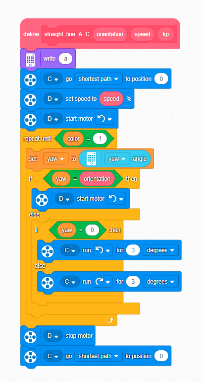
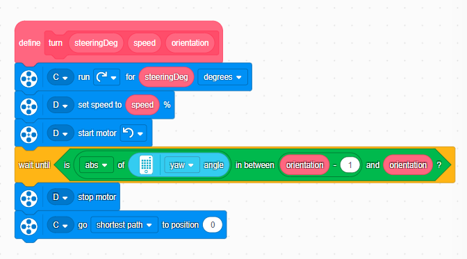

# ENGINEERS-OF-EPIRUS
We are students from the 2nd Intercultural Junior High School of Ioannina, Greece,  competing in the Future Engineers competition. Through this project,  we develop our STEM skills, team spirit, and creativity, proudly representing our school and the historic region of Epirus
we are angelomenos theodoros and aggelina kontogiani we are two people who like to innovate to participate in many competions robotics.                                 
# Future Engineers - Engineers of Epirus 🤖🚗

> This repository contains the source code and design files of our autonomous vehicle for the **WRO Future Engineers** competition. Our robot is built using the **LEGO Spike Prime** platform and utilizes the **DFRobot HuskyLens** AI camera for navigation and obstacle avoidance.

---

## Criterion 1: Mobility & Chassis

### 1.1 Chassis Architecture & Design
Our robot is constructed using the **LEGO Education Spike Prime** core set. A four-wheel configuration based on automotive principles (**Ackermann steering**) was selected, providing high stability when navigating the track's corners.

* **Dimensions:** The chassis dimensions are **20 cm x 10 cm**, remaining strictly within the competition's regulation limits ($30 \times 20 \times 30$ cm).
* **Weight Distribution:** The *Spike Prime Hub* is positioned at the **rear** of the chassis, ensuring a low center of gravity to prevent any tipping over during sharp turns.

---

### 1.2 Drive Mechanism
The robot's propulsion is transmitted to the **rear wheels** via a **Spike Prime Medium Motor**.

* **Power Transmission:** Power is delivered **directly** from the motor to the wheels without intermediate gearing, effectively minimizing mechanical backlash.
* **Wheel Selection:** * At the **rear**, large *LEGO Technic* wheels (62.4 x 20 mm diameter) are utilized to provide the necessary traction (grip), preventing wheel spin and ensuring precise distance tracking via the built-in motor encoders.
  * At the **front**, medium *Spike Prime* wheels (56 × 14 mm dimensions) are implemented to achieve optimal agility and steering precision.

---

### 1.3 Steering Mechanism
For steering and navigation, a front-wheel steering mechanism was designed, controlled by a second **Spike Prime Medium Motor**.

> **Engineering Decision:** We chose *Ackermann steering* over a differential drive setup because it delivers a smoother and much more predictable trajectory through turns, drastically reducing wheel slippage.

* **Steering Mechanics:** The motor converts rotational movement into linear/lateral motion, moving a steering **linkage** that turns both front wheels simultaneously.
* **Steering Angle:** The maximum steering angle of the wheels is mechanically limited to **25°** to prevent motor stalling and loss of vehicle control.
* **Alignment:** A hardware **calibration** routine is executed upon startup, forcing the motor to find its exact "center" (absolute straight line) before the competitive round begins.
* 
## Criterion 2: Sensors & Electronics

### 2.1 Sensor Selection & Mission Profile
For autonomous navigation and precise obstacle avoidance on the track, the vehicle is equipped with the following sensors:

* **HuskyLens Vision Sensor (AI Camera):** This serves as the primary sensor for obstacle avoidance. The HuskyLens is mounted at the **front** of the robot at an optimal height to ensure a clear line of sight to both red and green obstacles.
  * **AI Mode:** We utilize the **"Object Classification"** mode. The camera is pre-trained to recognize:
    * Red obstacles
    * Green obstacles
  * **Purpose:** The HuskyLens transmits real-time data to the Spike Prime Hub regarding the type (red/green) and position (X/Y coordinates) of the nearest obstacle. The algorithm processes this telemetry to decide whether to steer right (to avoid a green obstacle) or left (to avoid a red obstacle), according to the competition rules.

> **Engineering Decision: Object Classification vs. Color Recognition**
> We chose *Object Classification* over simple color recognition to guarantee the robot's robustness. Standard color recognition is highly vulnerable to changes in ambient light, which can cause false positives due to shadows or external optical interference. By training the HuskyLens with Object Classification, the AI model combines shape, volume, and color features. This makes our autonomous driving resilient and dependable under any lighting conditions on the track.

* **Spike Prime Ultrasonic Sensor:** Mounted **laterally on the right side** of the robot. It is used to measure the exact distance from the track walls, helping the vehicle maintain a stable trajectory and avoid collisions.
* **Spike Prime Color Sensor:** Positioned **low at the front, facing the ground**. It is used to detect the blue and orange lines on the track surface.
* **Inertial Measurement Unit (Internal IMU / Gyro):** We utilize the built-in 6-axis gyroscopic sensor of the Spike Prime Hub. It is responsible for tracking the robot’s heading angle with degree-level precision, ensuring the vehicle executes exact $90^{\circ}$ or $180^{\circ}$ turns and maintains a straight course.

---

### 2.2 Electronic Connectivity & Custom Wiring
The integration between the HuskyLens and the Spike Prime Hub was accomplished via a **custom wire harness** designed and fabricated by our team, eliminating the need for any external electronic converters.

* **Technical Implementation:** The HuskyLens is configured to communicate via the **UART (Serial)** protocol. We manufactured a 4-wire cable, mapping the HuskyLens pins directly to the Spike Prime connector as follows:
  * **VCC (Power):** Draws power directly from the Hub to the camera.
  * **GND (Ground):** Establishes a common ground for the circuit.
  * **RX / TX (Data):** Crosses the Receive (RX) and Transmit (TX) data lines, allowing the Spike Prime Hub to seamlessly ingest obstacle coordinates from the HuskyLens.
* **Advantage:** This direct-wiring solution reduced overall vehicle weight, eliminated the dependency on a secondary battery pack, and guaranteed near-zero data latency for the AI vision feedback loop.

#### Port Mapping (Updated)

| Component | Port | Function |
| :--- | :---: | :--- |
| **Rear Motor (Large)** | **D** | Vehicle Propulsion (Drive) |
| **Front Motor (Medium)** | **C** | Steering Control (Ackermann) |
| **HuskyLens Vision Sensor** | **A** | Red/Green Obstacle Recognition |
| **Ultrasonic Sensor** | **B** | Wall Distance Measurement |
| **Color Sensor** | **E** | Track Floor Line Detection |

#### Cable Management
All wiring, including the custom HuskyLens serial cable, is neatly routed along the **top section of the chassis** and secured using zip-ties. This prevent cables from tangling with the wheels or mechanical linkages, while reducing electronic noise and accidental disconnections during the race.

## Criterion 3: Software & Algorithms

### 3.1 Software Strategy & Architecture
Our team's code development was divided into two distinct phases, mapping directly to the mechanical and algorithmic evolution of the robot from Round 1 to Round 2:

* **Phase 1 (Round 1 - Spike Prime Blocks):** For the initial round, we selected Word Blocks (Scratch-based programming). Our primary goal was to rapidly deploy a stable, highly readable codebase, focusing on the mechanical calibration of the Ackermann steering system and establishing foundational movement routines.
* **Phase 2 (Round 2 - Python):** For the second round, we migrated the entire program logic to **Python (SPIKE v3 API)**. Moving to Python enabled us to ingest HuskyLens telemetry with significantly higher execution speeds, apply precise mathematical formulas for gyro-assisted line tracking, and organize our software architecture into modular classes and functions.

---

### 3.2 Code Structure per Phase

#### A. Round 1: Word Blocks Implementation
In Round 1, the software architecture leverages parallel execution threads and introduces **two custom My Blocks**: one dedicated to driving straight and another optimized for executing precise turns.

#### A. Round 1: Word Blocks Implementation
In Round 1, the software architecture leverages parallel execution threads and introduces **two custom My Blocks**: one dedicated to driving straight and another optimized for executing precise turns.

> **Advanced Color Detection via RGB Components (Blocks)**
> During the first round, the LEGO color sensor had to accurately identify the orange lines on the track. Since the native SPIKE software does not include orange as a predefined color enum, we avoided the standard "Color Detection" block, which was highly prone to errors under changing ambient light. 
> Instead, we developed a custom algorithm within Blocks that directly reads raw **RGB components**. By establishing a strict threshold where the Red channel is dominant over Blue and Green ($R > 75\%$ and $G < 60\%$), we achieved 100% accuracy in orange line detection regardless of room lighting variations.

---

#### B. Round 2: Python Implementation (Object-Oriented)
For Round 2, the code was refactored into an object-oriented Python program. We utilize low-level serial communication protocols to filter incoming UART data packets from the HuskyLens. 

The main control loop continuously evaluates conditional logic: **IF** the HuskyLens returns a valid obstacle ID, the program sends a direct steering angle command to the front steering motor; **ELSE**, the gyro-assisted straight driving routine is activated to keep the vehicle on course.

Below is an structural example of the custom Python architecture we developed for SPIKE v3:

python
import hub
import motor
import time
from huskylens import HuskyLensCamera  # Pre-loaded local module on the Hub

# 1. HARDWARE PORT MAPPING
PORT_STEER = hub.port.B
PORT_DRIVE = hub.port.A

# 2. INITIALIZATION & CALIBRATION
motor.absolute_position(PORT_STEER, 0) # Calibrate steering mechanism to absolute center

huskyLens = HuskyLensCamera(hub.port.A, baudrate=9600, debug=False)
huskyLens.algorithm("ALGORITHM_OBJECT_CLASSIFICATION")

# 3. CONTROL LOOP VARIABLES
BASE_SPEED = 300  # Measured in Degrees Per Second (DPS)
alpha = 0.7       # Exponential smoothing filter factor
ex = 0            # Horizontal error tracker

# Engage rear propulsion motor
motor.run(PORT_DRIVE, BASE_SPEED)

# 4. MAIN AUTONOMOUS CONTROL LOOP
while True:
    blocks = huskyLens.getBlocks()

    if len(blocks) > 0:
        # Focus on the primary detected obstacle block
        block = blocks[0]
        cx = block.x
        
        # Apply exponential low-pass filter to smooth the steering response
        ex = (1 - alpha) * ex + alpha * (160 - cx)
        
        # ACKERMANN STEERING LOGIC
        if block.ID == 1:   # RED OBSTACLE -> Steer RIGHT
            steering_angle = int(25 + (ex * 0.1))
        elif block.ID == 2: # GREEN OBSTACLE -> Steer LEFT
            steering_angle = int(-25 + (ex * 0.1))
            
        # Hardware Safety Limit Clamp (Prevents structural strain on linkages)
        steering_angle = max(min(steering_angle, 35), -35)
        
        # Execute non-blocking servo movement to the calculated angle
        motor.run_to_absolute_position(PORT_STEER, steering_angle, velocity=500)
        
    else:
        # NO OBSTACLE DETECTED -> Default to Gyro Straight Alignment
        ex = 0
        motor.run_to_absolute_position(PORT_STEER, 0, velocity=500)
        
    time.sleep(0.05) # Execution loop timing constraint

## Criterion 4: Testing & Calibration

### 4.1 Steering Calibration
We conducted extensive physical trials to map the rotational degrees of the `steer_motor` to the actual directional angle of the front wheels. To safeguard the structural integrity of the steering components, we established a strict software safety boundary. The maximum travel of the steering mechanism was digitally clamped between $-35^{\circ}$ (maximum left lock) and $+35^{\circ}$ (maximum right lock), preventing physical binding, motor stalling, and drivetrain strain.

### 4.2 AI Model Training
The HuskyLens vision sensor was trained independently using distinct dataset classes to allocate stable object tracking profiles. It was trained to assign **ID 1** specifically to the Red obstacles and **ID 2** to the Green obstacles. This calibration ensures that the vision processing pipeline reliably extracts correct, low-noise bounding boxes before deploying operational commands to the rear drive motor.

### 4.3 Software Integration Challenge: SPIKE v3 & HuskyLens
Given that the official LEGO SPIKE v3 API lacks native ecosystem support for third-party serial peripherals, our team engineered and integrated a custom UART Driver (`huskylens.py`) tailored for the SPIKE v3 hardware abstraction layer. We configured the camera's communication protocol to UART (Serial) at a 9600 baud rate. This enables the SPIKE v3 runtime engine to directly stream raw byte packets from the camera's frame buffer and deserialize them into structured Python objects (blocks) in real time, bypassing performance bottlenecks and minimizing the Hub's RAM overhead.

### 4.4 Deployment & File Management on SPIKE v3
To ensure reliable runtime execution, the HuskyLens UART driver framework needed to be instantly accessible during the boot sequence. We chose to embed the driver architecture as a compiled local module embedded directly inside the primary deployment script. This method eliminated directory path synchronization errors within the flash storage of the Hub, ensuring that the vehicle remains entirely autonomous and robust upon field deployment.

---

### Conclusion & Future Adaptations
Despite the steep engineering challenges and library breaking changes introduced by the new LEGO SPIKE Prime Version 3 Python API, our team successfully bridged the ecosystem gap with the HuskyLens AI Camera through custom physical wire hacking and low-level software integration. 

This technical approach allowed us to maintain our robot on LEGO's fastest and most optimized software framework to date, guaranteeing maximum loop execution frequency, system stability, and real-time response times for our Ackermann autonomous driving algorithms on the track.
